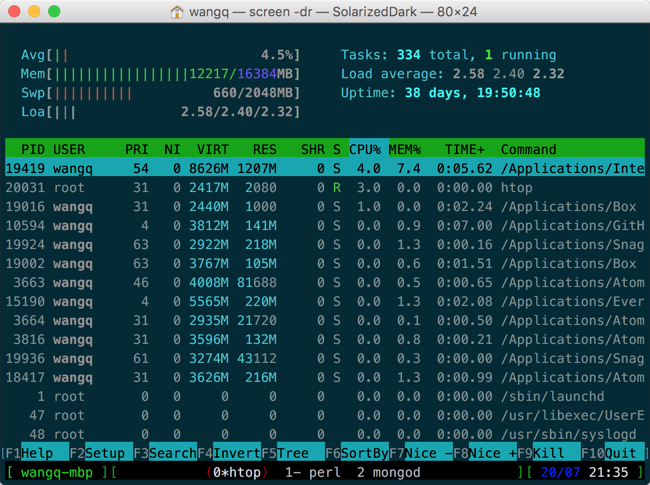

# My configuration files on macOS



## Install `brew`

[Homebrew](https://brew.sh/) or [Linuxbrew](https://docs.brew.sh/Homebrew-on-Linux)

## Configurations managed by GNU stow

* `bash install.sh`
  * [bash](stow-bash/)
  * [git](stow-git/)
  * [perltidy](stow-perltidy/)
  * [proxychains](stow-proxychains/)
  * [GNU screen](stow-screen/)
  * [vim](stow-vim/)
  * [wget](stow-wget/)

## macOS and Ubuntu

* [`brew.sh`](brew.sh)
  * Install CLI apps via Homebrew/Linuxbrew

* [`perl`](perl/)
  * `bash perl/install.sh`
  * `bash perl/ensembl.sh`

* [`python`](python/)
  * `bash python/install.sh`

* [`r`](r/)
  * `bash r/install.sh`

* [`rust`](rust/)
  * `bash rust/install.sh`

* Vim plugins
  * `git clone https://github.com/VundleVim/Vundle.vim.git ~/.vim/bundle/Vundle.vim`
  * `vim +PluginInstall +qall`

* Bioinformatics
  * [`download.sh`](download.sh)
    * My repos, jkbin and circos
  * [`genomics.sh`](genomics.sh)
    * Install apps from brewsci and my own homebrew-tap
  * [`others.sh`](others.sh)
    * Install Trinity and interproscan manually

* [TexLive](tex/texlive.md)
  * TinyTex
  * Fonts

## macOS only

* [`macos.sh`](macos.sh)
  * Extracted from
    [Mathias’s dotfiles](https://github.com/mathiasbynens/dotfiles/blob/master/.macos)

* [`brewcask.sh`](brewcask.sh)
  * Install GUI apps via Homebrew Cask

## Packages

The dir [packages/](packages/) stores installed packages managed by various package managers.

* Homebrew
    * `brew_tap.txt`
    * `brew_list.txt`
    * `brew_cask.txt`

* Python `pip_list.txt`

* R `r_list.txt`

* node.js `npm_list.txt`

* VSCode `vscode_list.txt`

I'm writing them down here to make it easier to compare them between different machines and see if there are something missing.

```shell
mkdir -p $HOME/Scripts/dotfiles/packages
WHERE="$HOME/Scripts/dotfiles/packages"

# store
brew tap            | sort > ${WHERE}/brew_tap.txt
brew list --formula | sort > ${WHERE}/brew_list.txt
brew list --cask    | sort > ${WHERE}/brew_cask_list.txt

pip3 freeze > ${WHERE}/pip_list.txt

npm list -g --depth=0 > ${WHERE}/npm_list.txt

Rscript -e 'cat(.Library, "\n"); cat(.Library.site, "\n");' |
  xargs ls |
  sort -u \
  > ${WHERE}/r_list.txt

tlmgr list --only-installed --data 'name' > ${WHERE}/tlmgr_list.txt

code --list-extensions > $HOME/Scripts/dotfiles/packages/vscode_list.txt

# restore
pip install -r ${WHERE}/pip_list.txt

```

## Plugins for cross-platform applications

* Firefox
  * fire-drag
  * Surfingkeys
  * Tampermonkey
  * uBlock Origin

* CLion
  * .ignore
  * CSV
  * EditorConfig
  * ini
  * Perl
  * Template Toolkit Support
  * Rust
  * Toml
  * PowerShell
  * R Language for IntelliJ
  * TeXiFy IDEA

* VS Code
    * EditorConfig.EditorConfig
    * OrangeX4.latex-sympy-calculator
    * ms-vscode.powershell
    * mechatroner.rainbow-csv
    * ms-vscode-remote.remote-wsl
