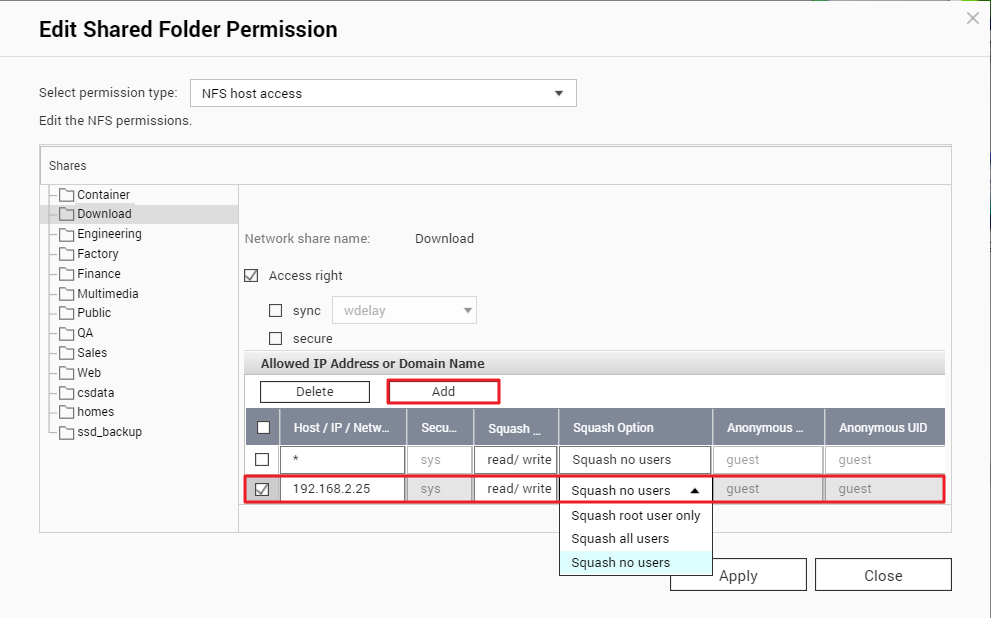

# Ubuntu 26.04

## Distro

https://learn.microsoft.com/en-us/windows/wsl/use-custom-distro


```powershell
# Pull the Ubuntu 26.04 image from Docker Hub
docker pull ubuntu:26.04

# Run a temporary Ubuntu 26.04 container and execute 'ls /' to list the root directory contents
docker run -t --name wsl_export ubuntu:26.04 ls /

# Create a directory to store the exported container file
mkdir -p $HOME\VM

# Export the specified container and save it as a tar file
docker export wsl_export > $HOME\VM\resolute.tar

docker rm wsl_export

# Import the exported container tar file into WSL, creating a WSL instance named resolute
wsl --import resolute $HOME\VM\resolute $HOME\VM\resolute.tar

# List all WSL instances and their version information
wsl -l -v

# Start the WSL instance named resolute
wsl -d resolute

# To refresh the wsl.conf configuration file (if needed)
# Terminate the resolute instance to achieve this
# wsl --terminate resolute

# wsl --unregister resolute --force

```

## Base system

As `root`

```bash
apt-get -y update
apt-get -y upgrade

apt-get -y install sudo vim
# ip ping ifconfig ps
apt-get -y install iproute2 iputils-ping net-tools procps

```

## Add user

As `root`

```bash
myUsername=wangq

useradd -s /bin/bash -m -G sudo $myUsername

echo -e "[user]\ndefault=$myUsername" >> /etc/wsl.conf
echo -e "[interop]\nappendWindowsPath=false" >> /etc/wsl.conf

passwd $myUsername

```

## ssh

```bash
sudo apt -y update
sudo apt -y upgrade

sudo apt -y install ssh ufw

sudo systemctl start ssh
sudo systemctl enable ssh
sudo systemctl status ssh

sudo ufw allow ssh
sudo ufw enable

```

### From a Windows machine

https://superuser.com/questions/1747549/alternative-to-ssh-copy-id-on-windows

```powershell
type $HOME\.ssh\id_rsa.pub | ssh wangq@ser5 "cat >> .ssh/authorized_keys"

```

## smb

https://ubuntu.com/tutorials/install-and-configure-samba

```bash
# server
sudo apt -y update
sudo apt -y upgrade

sudo apt -y install samba

# Setting up Samba
sudo bash -c 'cat >> /etc/samba/smb.conf <<EOF
[wangq]
    comment = Home Directory of wangq
    path = /home/wangq
    browsable = yes
    read only = no
EOF'

sudo service smbd restart
sudo ufw allow samba

# Setting up User Accounts
sudo smbpasswd -a wangq

# client
sudo apt -y update
sudo apt -y install cifs-utils

```

## Disks

* `/home/wangq/data` 2 TB SSD

`/dev/disk/by-id/usb-Samsung_PSSD_T7_S5TDNS0T330981K-0:0-part1 /home/wangq/data auto nosuid,nodev,nofail 0 0`

## nfs

Qnap

* Enable NFS v2/v3 and/or NFS v4
* Edit Shared Folder Permission
  * NFS host access



```bash
# ubuntu
sudo apt -y update
sudo apt -y install nfs-common

mkdir -p /home/wangq/nfs

sudo mount -t nfs 192.168.31.209:/share/data /home/wangq/nfs
sudo umount /home/wangq/nfs

# /etc/fstab
192.168.31.209:/share/data /home/wangq/nfs nfs rsize=8192,wsize=8192,timeo=14,intr

sudo systemctl daemon-reload

```

## Desktop

### Gnome remote desktop

```bash
sudo ufw allow from any to any port 3389 proto tcp
sudo ufw allow from any to any port 3390 proto tcp
sudo ufw reload

```

### Gnome shell

```bash
# quicklook
sudo apt -y install gnome-sushi

# extensions
sudo apt -y install gnome-shell-extension-manager gir1.2-gtop-2.0 lm-sensors

# Open the Extension Manager (installed above), search for
# * Vitals
# * Allow Locked Remote Desktop

# https://askubuntu.com/questions/1515740/swap-memory-really-leak-on-freshish-install-of-24-04
gnome-extensions disable ding@rastersoft.com

```

### R studio

```bash
# sudo apt-get install gdebi-core

# wget https://download2.rstudio.org/server/jammy/amd64/rstudio-server-2024.09.1-394-amd64.deb
# sudo gdebi rstudio-server-2024.09.1-394-amd64.deb

# sudo rstudio-server verify-installation
# # sudo apt-get remove --purge rstudio-server

# wget https://download1.rstudio.org/electron/jammy/amd64/rstudio-2024.09.1-394-amd64.deb
# sudo gdebi rstudio-2024.09.1-394-amd64.deb

```

### Clash

```bash
sudo apt -y install curl
sudo apt -y install libfuse2t64

curl -LO https://github.com/libnyanpasu/clash-nyanpasu/releases/download/v1.6.1/clash-nyanpasu_1.6.1_amd64.AppImage
chmod +x clash-nyanpasu_1.6.1_amd64.AppImage

mkdir -p ~/bin
mv clash-nyanpasu_1.6.1_amd64.AppImage ~/bin

```

### Apps

```bash

# zed
curl -f https://zed.dev/install.sh | sh

```

## Snap

Accepts system proxy

```bash
sudo snap install ghostty --classic
sudo snap install github-desktop --beta --classic

```

## Flatpak

```bash
# flatpak
sudo apt -y install flatpak
flatpak remote-add --if-not-exists flathub https://flathub.org/repo/flathub.flatpakrepo
flatpak remote-add --if-not-exists --user flathub https://flathub.org/repo/flathub.flatpakrepo

# railway
flatpak remote-add --if-not-exists --user launcher.moe https://gol.launcher.moe/gol.launcher.moe.flatpakrepo
# --user can't download wine and dxvk
sudo flatpak install org.gnome.Platform//47
flatpak install launcher.moe moe.launcher.the-honkers-railway-launcher

# flatpak install --user flathub io.mpv.Mpv
# flatpak install --user flathub info.smplayer.SMPlayer
# flatpak install --user flathub io.github.celluloid_player.Celluloid
flatpak install --user flathub org.videolan.VLC

# flatpak install --user flathub io.github.shiftey.Desktop
# flatpak install --user flathub com.visualstudio.code

flatpak install --user flathub org.qbittorrent.qBittorrent
flatpak install --user fr.handbrake.ghb
flatpak install --user flathub org.zotero.Zotero
flatpak install --user flathub com.tencent.WeChat
flatpak install --user flathub com.tencent.wemeet
flatpak install --user flathub cn.wps.wps_365

# Edge is a little blurry at 200% scaling via https://packages.microsoft.com/repos/edge
flatpak install --user flathub com.microsoft.Edge

flatpak install --user flathub com.jetbrains.RustRover

# https://itsfoss.com/gpu-usage-linux/
flatpak install --user flathub io.missioncenter.MissionCenter

# Remove unused packages
flatpak uninstall --unused

```

## pggb

```bash
sudo apt -y install singularity-container

singularity version
#4.1.1

singularity pull docker://ghcr.io/pangenome/pggb:latest
mv pggb_latest.sif ~/share/

cd ~/data
git clone --recursive https://github.com/pangenome/pggb.git
cd pggb

singularity run -B ${PWD}/data:/data ~/share/pggb_latest.sif pggb -i /data/HLA/DRB1-3123.fa.gz -p 70 -s 3000 -n 10 -t 8 -o /data/out

```

## Waydroid

```bash
sudo apt -y install curl ca-certificates
curl -s https://repo.waydro.id | sudo bash
sudo apt -y install waydroid

waydroid prop set persist.waydroid.width "1280"
waydroid prop set persist.waydroid.height "720"
waydroid prop set persist.waydroid.fake_wifi '*'

sudo waydroid container restart

# remove waydroid default app
sudo waydroid shell
pm uninstall --user 0 com.android.calculator2
pm uninstall --user 0 org.lineageos.etar
pm uninstall --user 0 com.android.gallery3d
pm uninstall --user 0 org.lineageos.eleven
pm uninstall --user 0 org.lineageos.recorder
pm uninstall --user 0 com.android.contacts

# firewall
sudo waydroid session stop
sudo waydroid container stop

sudo ufw allow 67
sudo ufw allow 53
sudo ufw default allow FORWARD

# arm translate
sudo apt install lzip

git clone https://github.com/casualsnek/waydroid_script
cd waydroid_script
python3 -m venv venv
venv/bin/pip install -r requirements.txt
sudo venv/bin/python3 main.py install libndk
sudo venv/bin/python3 main.py install libhoudini

# go to www.apkmirror.com

waydroid app install ~/Download/com.

```
